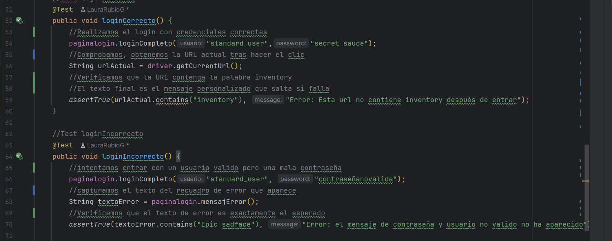

# 🌸 Práctica de Automatización: SauceDemo 🌸

*Un proyecto de pruebas automatizadas aplicando el patrón Page Object Model (POM).* 🎀

---

## 💗 1. Descripción del Proyecto
Este proyecto es una práctica evaluable de automatización de pruebas de software sobre la web [SauceDemo](https://www.saucedemo.com/). El objetivo principal es simular el comportamiento de un usuario real (login, selección de productos y validación del carrito de compras) utilizando herramientas de calidad de software y asegurando que la aplicación responda como se espera mediante aserciones.

---

## 🌷 2. Tecnologías Usadas
* **Lenguaje:** Java
* **Framework de Pruebas:** JUnit 5 (Júpiter)
* **Automatización Web:** Selenium WebDriver
* **Gestión de Drivers:** WebDriverManager (Bonigarcia)
* **Patrón de Diseño:** Page Object Model (POM)

---

## 🎀 3. Estructura del Código y Arquitectura

El proyecto está diseñado utilizando el patrón **Page Object Model (POM)**. Esta arquitectura es fundamental en el QA Automation porque nos permite separar estrictamente la lógica de la interfaz de usuario (los mapeos de la web) de la lógica de las pruebas (las aserciones y comprobaciones). 

El código se divide en dos paquetes principales: `pages` y `test`.

### 📦 Paquete `pages` (Mapeo de la Web)
Aquí se encuentran las clases que representan las pantallas físicas de la aplicación. No contienen aserciones, solo localizadores y acciones.

#### 🌸 Clase `LoginPage`
Esta clase representa la pantalla principal de inicio de sesión. Maneja la comunicación exclusiva con el formulario de entrada.
* **Localizadores (Locators):** Se ha priorizado el uso de `By.id()` por ser la forma más rápida y segura de encontrar elementos en el DOM.
  * `userField` *(By.id("user-name"))*: Localiza el campo de texto destinado al nombre de usuario.
  * `passField` *(By.id("password"))*: Localiza el campo oculto para la contraseña.
  * `loginBtn` *(By.id("login-button"))*: Localiza el botón de "Login" que envía el formulario.
  * `errorMsg` *(By.cssSelector("[data-test='error']"))*: Utiliza un selector CSS avanzado para capturar el contenedor dinámico que aparece cuando el login falla.
* **Métodos de Acción:**
  * `ingresarUsuario(String usuario)`: Primero utiliza `.clear()` por seguridad para vaciar el campo y luego `.sendKeys()` para escribir el usuario.
  * `ingresarPassword(String password)`: Sigue la misma lógica de limpieza y escritura para la contraseña.
  * `botonLogin()`: Ejecuta la acción `.click()` sobre el botón.
  * `loginCompleto(String usuario, String password)`: Método optimizado que encapsula los tres pasos anteriores, permitiendo a los tests iniciar sesión con una sola línea de código.
  * `mensajeError()`: Utiliza `.getText()` para extraer y devolver el texto exacto del error mostrado en pantalla.

#### 🌸 Clase `InventoryPage`
Representa la pantalla del catálogo de productos y la cabecera donde se encuentra el carrito de compras.
* **Localizadores (Locators):**
  * `botonaddMochila` / `botonaddLuz` *(By.id)*: Localizadores específicos para los botones de añadir de la mochila y la luz de bicicleta.
  * `botonremoveMochila` / `botonremoveLuz` *(By.id)*: Localizadores de los botones rojos de "Remove" que reemplazan a los de añadir tras hacer clic.
  * `botoncarrito` *(By.className("shopping_cart_badge"))*: Localiza el pequeño círculo rojo (badge) que contiene el número total de productos.
  * `tituloPagina` *(By.className("title"))*: Localiza la cabecera superior de la página para verificaciones de navegación.
* **Métodos de Acción:**
  * `anadirMochila()` y `anadirLuz()`: Realizan un `.click()` en sus respectivos botones para meter los artículos al carrito.
  * `obtenerTotalCarrito()`: Lee y devuelve mediante `.getText()` el número que aparece dentro del badge rojo del carrito (en formato String).
  * `botonRemoveAparece()`: Utiliza el comando `.isDisplayed()` para devolver un valor booleano (`true` o `false`) comprobando si el botón de eliminar es visible en el DOM.
  * `iraCarrito()`: Realiza un clic en el icono superior derecho para acceder a la vista detallada de la cesta.
  * `obtenerTituloPagina()`: Extrae el texto del título principal para poder confirmar en qué pantalla nos encontramos.

---

### 📦 Paquete `test` (Casos de Prueba)
Aquí reside la lógica de validación. Utiliza JUnit 5 para orquestar la ejecución, la preparación y el cierre del navegador.

#### 🛠️ Configuración Global de los Tests (`@BeforeEach` y `@AfterEach`)
* En ambas clases de test, el método `setUp()` inicializa ChromeDriver, maximiza la ventana y **aplica una espera implícita (`implicitlyWait`) de 5 segundos**. Esto hace que las pruebas sean robustas frente a pequeños retrasos de carga de la web.
* El método `tearDown()` asegura que, pase lo que pase en la prueba, el navegador se cierre limpiamente usando `driver.quit()`.

#### 💖 Clase `LoginTest`
Valida los flujos de seguridad y acceso a la plataforma.
* `loginCorrecto`: 
  1. Utiliza `loginCompleto()` con credenciales válidas.
  2. Lee la URL actual usando `driver.getCurrentUrl()`.
  3. Valida mediante un `assertTrue` que la URL contiene la palabra "inventory", demostrando que el sistema redirigió al usuario correctamente.
* `loginIncorrecto`: 
  1. Intenta acceder con un usuario correcto pero una contraseña inventada.
  2. Extrae el texto del error visible.
  3. Valida con `assertTrue` que el mensaje contiene la frase "Epic sadface", asegurando que el sistema rechaza el acceso no autorizado.

#### 💖 Clase `InventoryTest`
Valida la interacción con el catálogo y la lógica de la cesta de la compra.
* `anadirProducto`: Inicia sesión, hace clic en añadir la mochila, lee el número del carrito y usa un `assertEquals` para confirmar que el valor es exactamente "1".
* `anadirdosProductos`: Añade dos productos secuencialmente (mochila y luz). Valida mediante un `assertEquals` que el badge del carrito se actualiza correctamente al valor "2".
* `botoncambiaremove`: Tras añadir la mochila al carrito, llama al método booleano de la página y utiliza un `assertTrue` para verificar que la interfaz de usuario ha reaccionado cambiando el botón de "Add" a "Remove".
* `extraAccesoAlCarrito` *(Ampliación Extra)*: Prueba el flujo de navegación interna. Tras añadir un producto, entra a la vista del carrito. Realiza una **doble aserción**: primero verifica que la URL contiene "cart" (`assertTrue`) y luego verifica que el título de la página ha cambiado a "Your Cart" (`assertEquals`), garantizando una navegación impecable.

---

## 📸 4. Capturas de Ejecución

*(Sustituye la ruta de la imagen por tu captura real)*

> **Nota:** Todos los tests se han ejecutado correctamente pasando a color verde (Passed).

 

*(Si quieres subir varias, añade más líneas iguales con las rutas de tus otras imágenes)*

---

## 🧠 5. Apreciación y Reflexión Personal

Esta tarea me ha resultado bastante compleja. Pero al igual que ha resultado ser un reto con tantísimas dificultades que he tenido por el camino, he aprendido mucho sobre cómo usar mejor el driver de Selenium y sobre todo una cosa que me ha gustado mucho es poder ver el uso de las id que tanto hemos visto en la asignatura de Lenguaje de Marcas y ver uno de sus tantos usos.

Es verdad que al principio me costó ir cogiéndole el ritmo para poder ir entendiéndolo todo e ir sabiendo qué iba haciendo. Pero me ha encantado ver el mundo de la automatización desde otro ámbito de la programación.

Haciendo una conclusión general, no ha sido una tarea fácil pero me ha gustado mucho estar buscando e investigando un nuevo campo del que antes no había sabido. 🌸✨
